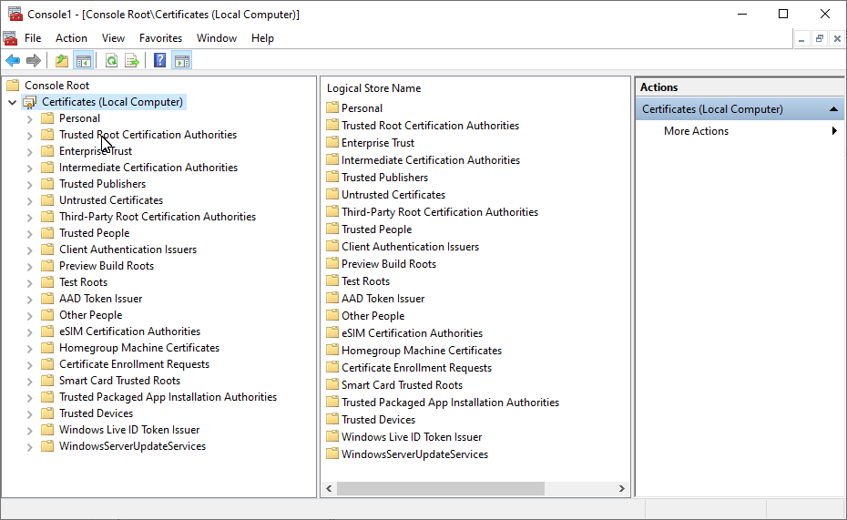
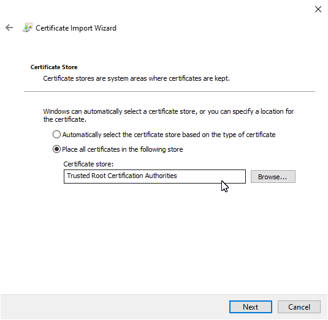
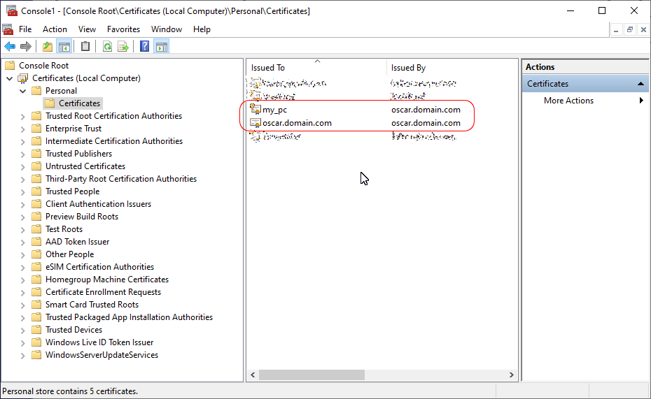

## Настройка клиента Windows

Речь пойдет о настройке Windows 10 для подключения к нашему VPN-серверу на базе strongSwan/IKEv2. Далее в тексте и на скриншотах 
англоязычная версия Windows.

### Создание сертификатов

Сертификаты и ключи клиентского устройства мы будем создавать на нашем сервере вызовом скрипта из данного проекта. 
Следует напомнить, что в примере, описанном в [инструкции по настройке сервера](server.html), сервер был назван 
`oscar` и доступ к нему осуществлялся по `oscar.domain.com`. Эти данные будут взяты из конфигурационного файла 
`config.json`. Назовем клиентское устройство неоригинально, `my_pc`:

```
./gen_client_key.py -w my_pc
```

В процессе исполнения скрипта надо будет придумать экспортный пароль для шифрования сертификата с ключом. Этот пароль 
потребуется для импорта сертификата в Windows.

Если все прошло ок, то добавятся три файла в папку `clients/<client name>`:  
`clients/my_pc/my_pc.pfx` — сертификат с закрытым ключом клиента для шифрования трафика;  
`clients/my_pc/my_pc.ps1` — PowerShell-скрипт для добавления VPN-соединения в Windows;  
`clients/my_pc/ca.pem` — сертификат удостоверяющего центра.

Готово.

### Импорт сертификатов 

На клиентское устройство с Windows потребуется перенести три вышеупомянутых файла с сервера.

Открываем консоль MMC:

```
mmc.exe
```

В меню `File → Add/Remove Snap-in...` выбираем `Certificates` и добавляем `Add >`. Появляется диалоговое окно, в 
нем 
поочередно выбираем: `Computer account`, `Local computer`, далее `Finish` и `OK`. Получим окно с деревом сертификатов 
слева.



В левой стороне открываем дерево, выбираем папку `Trusted Root Certification Authorities`, в ней `Certificates` и 
жмем на нее правой кнопкой. В контекстном меню `All Tasks → Import...`. В новом диалоговом окне пролистываем до 
момента выбора файла, в котором выбираем наш `ca.pem` (для этого фильтр придется установить в `*.*`). На дальнейший 
вопрос о том, куда поместить файл, отвечаем `Trusted Root Certification Authorities`. Со всем остальным соглашаемся.



Аналогичным образом импортируем второй сертификат с закрытым ключем клиента (`my_pc.pfx`), но только в папку 
`Personal`. В процессе импорта понадобится пароль, которым зашифровали сертификат на этапе его выпуска.
Все галки оставляем как есть.



Обратите внимание на то, что у `my_pc` пиктограмма с ключом.

### Настройка VPN

Запускаем наш скрипт правой кнопкой мыши на `my_pc.ps1` и `Run with PowerShell`. В процессе работы скрипт спросит:

```
Changing the Cryptography Settings. Do you want to continue?
[Y] Yes  [N] No  [S] Suspend  [?] Help (default is "Y"):
```
Отвечаем "Y".

Настройка завершена, соединение создано, можно подключаться. Импортированные файлы можно удалить.
